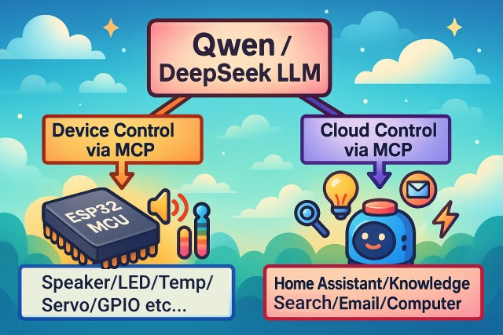

# 基于 虾哥 小智 的 双目机器人

原虾哥项目请参考：
https://github.com/78/xiaozhi-esp32
本源码在虾哥小智1.8.9基础上改编

## 虾哥视频

👉 [人类：给 AI 装摄像头 vs AI：当场发现主人三天没洗头【bilibili】](https://www.bilibili.com/video/BV1bpjgzKEhd/)

👉 [手工打造你的 AI 女友，新手入门教程【bilibili】](https://www.bilibili.com/video/BV1XnmFYLEJN/)

## 介绍

这是一个由虾哥开源的 ESP32 项目，以 MIT 许可证发布，允许任何人免费使用，或用于商业用途。

### 基于 MCP 控制万物

小智 AI 聊天机器人作为一个语音交互入口，利用 Qwen / DeepSeek 等大模型的 AI 能力，通过 MCP 协议实现多端控制。

## 硬件

## 软件

### 固件烧录

参考虾哥烧录教程

新手第一次操作建议先不要搭建开发环境，直接使用免开发环境烧录的固件。

固件默认接入 [xiaozhi.me](https://xiaozhi.me) 官方服务器，个人用户注册账号可以免费使用 Qwen 实时模型。

👉 [新手烧录固件教程](https://ccnphfhqs21z.feishu.cn/wiki/Zpz4wXBtdimBrLk25WdcXzxcnNS)

### 开发环境

- Cursor 或 VSCode
- 安装 ESP-IDF 插件，选择 SDK 版本 5.4 或以上
- Linux 比 Windows 更好，编译速度快，也免去驱动问题的困扰
- 本项目使用 Google C++ 代码风格，提交代码时请确保符合规范

### 开发者文档

- [自定义开发板指南](main/boards/README.md) - 学习如何为小智 AI 创建自定义开发板
- [MCP 协议物联网控制用法说明](docs/mcp-usage.md) - 了解如何通过 MCP 协议控制物联网设备
- [MCP 协议交互流程](docs/mcp-protocol.md) - 设备端 MCP 协议的实现方式
- [MQTT + UDP 混合通信协议文档](docs/mqtt-udp.md)
- [一份详细的 WebSocket 通信协议文档](docs/websocket.md)

## 大模型配置

如果你已经拥有一个小智 AI 聊天机器人设备，并且已接入官方服务器，可以登录 [xiaozhi.me](https://xiaozhi.me) 控制台进行配置。

👉 [后台操作视频教程（旧版界面）](https://www.bilibili.com/video/BV1jUCUY2EKM/)

## 相关开源项目

在个人电脑上部署服务器，可以参考以下第三方开源的项目：

- [xinnan-tech/xiaozhi-esp32-server](https://github.com/xinnan-tech/xiaozhi-esp32-server) Python 服务器
- [joey-zhou/xiaozhi-esp32-server-java](https://github.com/joey-zhou/xiaozhi-esp32-server-java) Java 服务器
- [AnimeAIChat/xiaozhi-server-go](https://github.com/AnimeAIChat/xiaozhi-server-go) Golang 服务器

使用小智通信协议的第三方客户端项目：

- [huangjunsen0406/py-xiaozhi](https://github.com/huangjunsen0406/py-xiaozhi) Python 客户端
- [TOM88812/xiaozhi-android-client](https://github.com/TOM88812/xiaozhi-android-client) Android 客户端
- [100askTeam/xiaozhi-linux](http://github.com/100askTeam/xiaozhi-linux) 百问科技提供的 Linux 客户端
- [78/xiaozhi-sf32](https://github.com/78/xiaozhi-sf32) 思澈科技的蓝牙芯片固件
- [QuecPython/solution-xiaozhiAI](https://github.com/QuecPython/solution-xiaozhiAI) 移远提供的 QuecPython 固件

## 感谢

虾哥

四博
